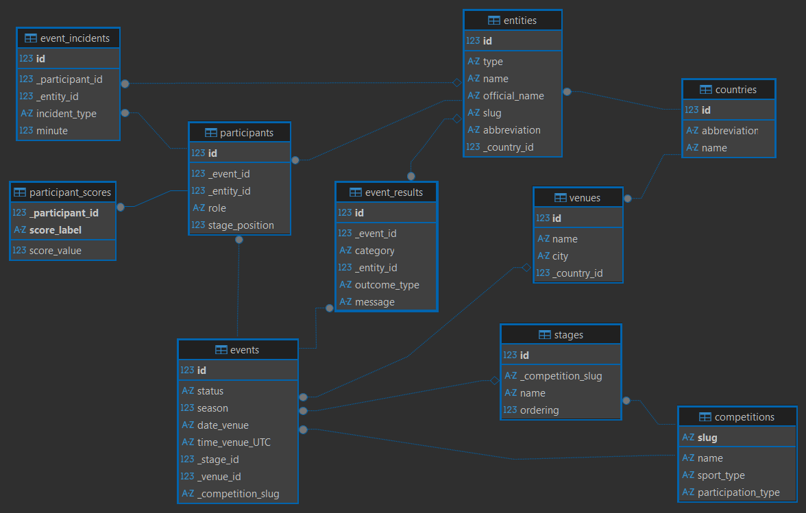

# Sports Calendar
The Sports Calendar is a backend-focused application designed to manage and serve sports events data. It provides an API for creating and reading events, along with related information, and serves this data to a frontend interface for users to view.

Key Features:
* Stores sports events in a SQLite database (`calendar_data.db`)
* Provides a REST/HTTP API via FastAPI for interacting with events
* Includes optional scripts to populate the database with sample data for testing


## Setup

### Prerequisites
* Python 3.10
* Dependencies from `requirements.txt` — install with:
```
pip install -r requirements.txt
```
## Steps
1) Create empty database file (`calendar_data.db`) in `/data` directory:

  * Linux / macOS:
  ```
  touch data/calendar_data.db
  ```
   * Windows:
  ```
  type nul > data\calendar_data.db
  ```

2) Run the database creation script:
  ```
  python src/backend/db/db.py
  ```

3) (Optional) Populate the database with sample data:
  ```
  python scripts/populate_db.py 
  ```

4) Start the backend API:
  ```
   uvicorn src.backend.api.main:app
  ```

   Swagger docs will be available at: `http://127.0.0.1:8000/docs`

5) Start the frontend:
  ```
  cd src/frontend
  python -m http.server 8000
  ```
  Frontend wil be available at: `http://localhost:8000`


## Project structure
```
Sports Calendar
│
├── /data
│   └── calendar_data.db        # SQLite database file
│
├── /scripts
│   └── populate_db.py          # Script to populate sample data
│
├── /seeds                      # JSON files used by populate_db
│
├── /src
│   ├── /backend
│   │   ├── /api
│   │   │   ├── main.py         # Run with uvicorn
│   │   │   └── /routes         # All API route modules
│   │   │
│   │   ├── /db
│   │   │   └── db.py           # Creates tables in the DB
│   │   │
│   │   ├── /models             # Pydantic models (requests & responses)
│   │   │
│   │   └── /services           # Business logic used by routers
│   │
│   └── /frontend               # Frontend UI
│
├── data-er-diagram.png         # ER diagram
│
├── data-exmpl.json             # Example data from instructions
│
└── requirements.txt            # Python dependencies
```

## ER Diagram



## Project assumptions / decisions
### Database:
* Events can have one of four statuses: `scheduled`, `live`, `played`, or `canceled`.

* A competition can consist of multiple events.

* If categories within a competition occur simultaneously (e.g., a marathon where men and women run at the same time but are scored separately), they are treated as a single event.

* If categories occur at different times (e.g., individual figure skating vs. pairs figure skating at the Olympics), they are treated as separate events.

* Sports are categorized into three participation types: `team`, `individual`, and `relay`.

* Country abbrieviations are not used as primary keys, because different sports organisations use different codes for the same country (f.ex. FIFA and the International Olympic Committee (IOC) sometimes assign different codes for the same country, and some entities are recognised by one organisation but not the other). This can cause inconsistency if data comes from multiple sources.

* Entities are objects that participate in an event. There are two types of entities: `team` or individual `athlete`. Individual athletes do not have abbreviations (their abbreviation field is null).

* Participants are assigned roles based on the sport: `home/away` for team sports (e.g., football) to indicate which team is hosting the match or `entry` for individual participants. Their stage position records their ranking at the end of a stage during the event.

* Participants can have multiple scores during an event, provided each score has a unique label. For example, in football, a participant could have separate scores for goals and penalties.

* Matches can result in `win`, `draw`, or `abandoned`.

* `Abandoned` matches are recorded in event_result, but the event status remains `"played"`.

* The `_entity_id` (winner) in event_score table  should only be set for matches with a win outcome.

* Event_incidents are associated with a participant. If the participant is a `team`, the `_entity_id` is used to link the incident to the specific athlete who was involved.

* The minute field in an event_incidents indicates the time during the event when the incident occurred.

### API:
* GET requests return as much detail as possible — not just IDs of related data, but the full connected information.

* You must add an event before adding participants. You must add participants before adding their event_incidents or participant_scores. Only after these three steps can you add event_results.

* Event results cannot be added to events that have been canceled.